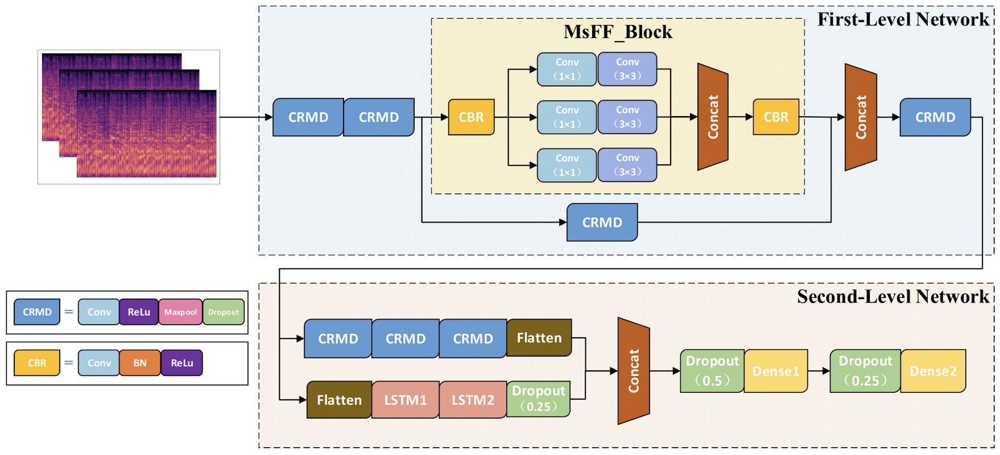

# CoGCNet: 粤剧流派分类

该项目基于论文 [The Sustainable Development of Intangible Cultural Heritage with AI: Cantonese Opera Singing Genre Classification Based on CoGCNet Model in China](https://www.mdpi.com/2071-1050/14/5/2923) 进行复现，对原论文中的模型进行了少量的修改。



## 数据准备和处理

该项目原则上可以进行任意类别数量的音频分类，数据需要组织成以下的格式：

> - 类别 1
>   - 音频文件 1 (30s)
>   - 音频文件 2 (30s)
>   - ...
> - 类别 2
>   - 音频文件 1 (30s)
>   - 音频文件 2 (30s)
>   - ...
> - 类别 3
> - ...

可以使用 `python3 processing.py -i 原音频文件/文件夹 -o 处理后音频文件夹 -c 配置文件` 对原始数据进行预处理，配置文件默认是 `config.yaml`。

## 训练模型

```python
conda activate cantcls
python3 train.py
```

在服务器上已经创建好了可用的环境 `cantcls`, 执行上述代码即可对模型进行训练。